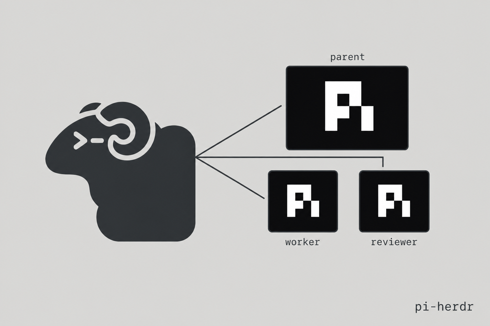

# pi-herdr



`@yunosukeyoshino/pi-herdr` lets Pi delegate work to a child Pi in a neighboring [Herdr](https://herdr.dev) pane. Use it when you want a specialist with its own model, a visible terminal you can watch, and a parent session that keeps its full toolset.

## Installation

```bash
pi install npm:@yunosukeyoshino/pi-herdr
```

That is the only required package step. The parent `pi` must run **inside a Herdr pane** (`HERDR_ENV=1`) so a sibling pane can be created. [Herdr](https://herdr.dev) itself is a separate install.

Git install also works:

```bash
pi install git:github.com/YunosukeYoshino/pi-herdr
```

## Try this first

You do not need to create roles, write config, or learn slash commands. After installing, ask Pi for delegation in plain language:

```text
Have worker implement the current TODOs.
```

```text
Use reviewer to review this diff. Do not implement.
```

```text
Have worker fix the README typo.
```

That is enough to start.

## What happens

Pi is the parent session. A herd child is a real `pi` process in a new Herdr pane, with a model chosen for its role.

When you ask for a worker or reviewer, the parent calls `herd_spawn`, splits a pane to the right, starts Pi, and sends the task. It returns a unique Herdr agent name such as `worker-a1b2c3d4`. Watch the child in that pane. The parent keeps working in yours.

`herd_spawn` waits until the child settles, then returns the name. It does not return the child's transcript. Look at the pane, or ask the parent to check status or send a follow-up.

Installing the extension does not start a child in the background. It gives Pi a delegation tool. If you want every implementation reviewed, say that in your prompt:

```text
When you finish implementing, spawn reviewer on the diff before summarizing.
```

This package is not a general Herdr controller. Other `pi-herdr` packages exist for layout, tab chrome, or transcript mirrors. This one only spawns role-based Pi children.

It can sit next to [`pi-subagents`](https://github.com/nicobailon/pi-subagents). Prefer `herd_spawn` when you want a **visible Herdr pane**. The `subagent` tool is a headless Pi process.

## Good first prompts

These cover most day-to-day use:

```text
Have worker implement this approved plan. Prefer small diffs and verify with tests.
```

```text
Use reviewer to review the current git diff. Report only actionable findings.
```

```text
Spawn worker on the failing test in src/parser.test.ts.
```

```text
Tell worker-a1b2c3d4 to add tests too.
```

```text
What's the status of worker-a1b2c3d4?
```

Those are ordinary Pi requests. Pi decides whether to call `herd_spawn`, `herd_steer`, or `herd_status`.

## Common workflows

| Want | Ask naturally |
|------|---------------|
| Implement something | “Have worker implement the current TODOs.” |
| Review a diff | “Use reviewer to review this diff. Do not implement.” |
| Follow up | “Tell worker-a1b2c3d4 to add tests too.” |
| Check progress | “What's the status of worker-a1b2c3d4?” |
| Pin a model for one run | “Spawn worker with model deepseek-v4-pro on this task.” |

The extension ships with two roles you can use immediately.

## Builtin roles in plain English

| Role | Use it when you want... |
|------|-------------------------|
| `worker` | Implementation work. Default model: `deepseek-v4-flash`. |
| `reviewer` | Code review only. Default model: `kimi-k3`. |

A simple rule of thumb: use `worker` to change code, `reviewer` to check it.

## Changing a role's model

For one run, say the model in the prompt. The parent can pass `model` on `herd_spawn`.

For a persistent override, edit settings:

```json
{
  "herd": {
    "defaultModel": "deepseek-v4-flash",
    "agentOverrides": {
      "reviewer": { "model": "kimi-k3" }
    }
  }
}
```

Use `~/.pi/agent/settings.json`. Model precedence, strongest first:

1. Per-run `model` on `herd_spawn`
2. Role frontmatter `model`
3. `herd.agentOverrides.<role>.model`
4. `herd.defaultModel`
5. The parent session model

## Where running children show up

Children occupy a Herdr pane to the right of the parent. They are live `pi` sessions you can focus, read, and type into.

Ask naturally:

```text
What's the status of worker-a1b2c3d4?
```

```text
Tell worker-a1b2c3d4 to add tests too.
```

| Tool | What it does |
|------|----------------|
| `herd_spawn` | Split a pane, start Pi, send the task |
| `herd_steer` | Send a follow-up prompt to a spawned agent |
| `herd_status` | Read Herdr status (`idle`, `working`, `blocked`, …) |

## Direct commands

You do not need this until you want exact syntax.

| Command | Description |
|---------|-------------|
| `/herd <role> <task>` | Tell the parent to call `herd_spawn` with that role and task |

```text
/herd worker fix the README typo
```

```text
/herd reviewer review the current git diff
```

## Custom roles

Roles are markdown files with YAML frontmatter. Bundled files live in `agents/` at the package root.

Add another role by dropping `agents/<name>.md` next to `index.ts`:

```markdown
---
name: researcher
model: deepseek-v4-flash
---
```

Only `name` and `model` in the frontmatter are read. The markdown body is not sent to the child.

## Structure

```txt
.
  index.ts                 # Pi entry — re-exports src/index.ts
  src/
    index.ts               # herd_spawn, herd_steer, herd_status, /herd
    launch/                # model resolve + pane spawn
    herdr/                 # herdr CLI adapter
    config/                # roles + settings.json
    lib/
  agents/                  # role markdown (name + model)
```

Tests live next to the source as `*.test.ts`.

## Development

```bash
bun test
```

## License

MIT
